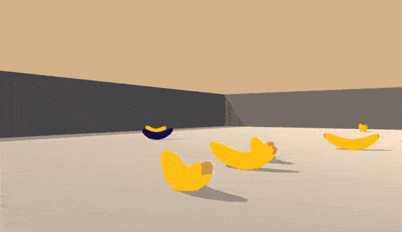

# Deep Q-Learning of Unity's Banana environment

## Introduction
This project was done as part of the Udacity Deep Reinforcement Nanodegree. Some of the text in this README is adapted from the original [Udacity Deep Reinforcement Learning Nanodegree repo](https://github.com/udacity/deep-reinforcement-learning).

This project explores Q-learning on the Unity Banana environment. For full details,
see `report/project.pdf`.

## Project details

For this project, an agent is trained to navigate and collect bananas in a large, square world.

A reward of +1 is provided for collecting a yellow banana, and a reward of -1 is provided for collecting a blue banana.  Thus, the goal of the agent is to collect as many yellow bananas as possible while avoiding blue bananas.  

The state space has 37 dimensions and contains the agent's velocity, along with ray-based perception of objects around agent's forward direction.  Given this information, the agent has to learn how to best select actions.  Four discrete actions are available, corresponding to:
- **`0`** - move forward.
- **`1`** - move backward.
- **`2`** - turn left.
- **`3`** - turn right.

The task is episodic, and in order to solve the environment, your agent must get an average score of +13 over 100 consecutive episodes.

## Getting Started

1. Make sure you have the following python library dependencies: 
    - pytorch
    - numpy
    - unityagents
    - pickle

2. Clone this repository with the command `git clone https://github.com/udacity/deep-reinforcement-learning.git` or simply download as a zip folder by using the green button labeled 'clone or download' on this page. Note that there is no need to separately download the Unity environment. The necessary files are included in the repo.

## Instructions

From root, run `python src/dqn/dqn_train.py` to train. After training is done, run `python src/dqn/dqn_test.py` to see the trained agent.